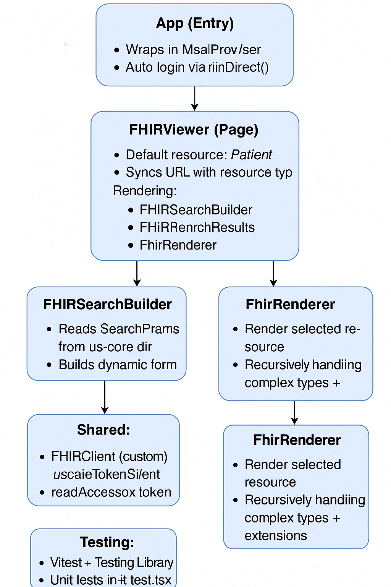

# FHIR Viewer App

This is a Vite-powered, MSAL-authenticated React application designed to search and render **any FHIR resource** from **any FHIR server or implementation guide**. It dynamically interprets `StructureDefinition` and `SearchParameter` files to enable reusable, schema-driven views for FHIR resources.

---

## Key Features

- **Universal FHIR Support**  
  Search and render any FHIR resource using `StructureDefinition.snapshot` from any server or IG.

- **Dynamic Search UI**  
  Builds adaptive search forms from US Core or custom `SearchParameter` definitions.

- **Generic Extension Rendering**  
  Handles complex FHIR extensions generically and recursively—no special cases for race, ethnicity, or others.

- **Reusable Architecture**  
  Modular React components that can be used across healthcare apps: `FHIRViewer`, `FHIRSearchBuilder`, `FHIRSearchResults`, and `FhirRenderer`.

- **Secure Access**  
  Uses MSAL (Microsoft Authentication Library) for login and access token management via `acquireTokenSilent`.

- **Design System**  
  Styled using BCBSNC’s Lighthouse Storybook component system for visual consistency.

---

## Component Architecture



---

## Components

### `App.tsx`
- Root entry point
- Authenticates user via `MsalProvider`
- Triggers `loginRedirect()` on first load

### `FHIRViewer`
- Tied to route (e.g., `/Patient`)
- Combines search, results, and details into one reusable view

### `FHIRSearchBuilder`
- Dynamically builds input form for search queries based on `SearchParameter`

### `FHIRSearchResults`
- Renders dynamic result table based on `StructureDefinition.snapshot`
- Supports recursive rendering and inline extensions

### `FhirRenderer`
- Recursively renders individual resources
- Fully resolves extensions, including those with nested structure

### `FHIRClient`
- Makes authenticated `read` and `search` requests to any FHIR server

### `useAccessToken`
- Centralized hook to acquire tokens via MSAL with fallback to redirect

---

## Getting Started

```bash
yarn install
yarn dev
```

### Run Tests

```bash
yarn test
```

---

## Notes

- Works with any FHIR R4+ server or IG that provides `StructureDefinition` and `SearchParameter` files
- Components are designed to be dropped into other FHIR-enabled apps
